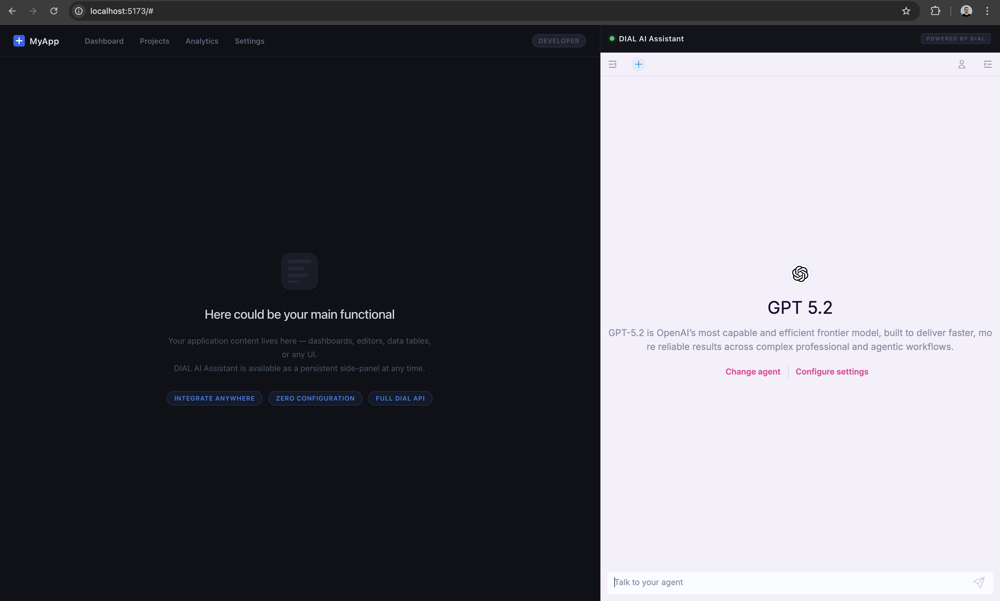

## Chat Overlay

## This task is optional and intended primarily for Frontend Engineers!

We integrate DIAL Chat into other applications with [Chat Overlay](https://docs.dialx.ai/tutorials/developers/chat/chat-design#overlay).

More details of [Chat Overlay](https://github.com/epam/ai-dial-chat/blob/development/libs/overlay/README.md)

1. Set env variables to `chat` service in [docker-compose.yml](/docker-compose.yml):
    - IS_IFRAME: true
    - ALLOWED_IFRAME_ORIGINS: http://localhost:5173/
2. Run in terminal:
   ```bash
   npm create vite@latest overlay-app 
   ```
   and choose options bellow:
    - project **Vanilla**
    - **js** (not ts)
    - **no** (just create project and that is all)
      After that you should be able to see the `overlay-app` folder [overlay-app](/overlay-app)
3. Run in terminal: 
   ```bash
   
   cd overlay-app
   ```
4. Run in terminal (to install base dependencies):
   ```bash
   npm i
   ``` 
5. Run in terminal (to install DIAL overlay library):
   ```bash
   npm i @epam/ai-dial-overlay
   ``` 
6. Replace content in `overlay-app/src/main.js` [main.js](/overlay-app/src/main.js) to:
   ```js
   import './style.css'
   import { ChatOverlay } from "@epam/ai-dial-overlay";
   
   document.querySelector('#app').innerHTML = `
     <div class="main-panel">
       <header class="app-header">
         <div class="header-brand">
           <div class="brand-logo">
             <svg width="20" height="20" viewBox="0 0 20 20" fill="none" xmlns="http://www.w3.org/2000/svg">
               <rect width="20" height="20" rx="4" fill="#2563eb"/>
               <path d="M5 10h10M10 5v10" stroke="#fff" stroke-width="2" stroke-linecap="round"/>
             </svg>
             <span class="brand-name">MyApp</span>
           </div>
           <nav class="header-nav">
             <a href="#" class="nav-link">Dashboard</a>
             <a href="#" class="nav-link">Projects</a>
             <a href="#" class="nav-link">Analytics</a>
             <a href="#" class="nav-link">Settings</a>
           </nav>
         </div>
         <div class="header-actions">
           <span class="user-badge">Developer</span>
         </div>
       </header>
   
       <div class="main-content">
         <div class="placeholder-icon">
           <svg width="64" height="64" viewBox="0 0 64 64" fill="none" xmlns="http://www.w3.org/2000/svg">
             <rect width="64" height="64" rx="16" fill="#1e2130"/>
             <rect x="12" y="12" width="40" height="6" rx="3" fill="#2d3148"/>
             <rect x="12" y="24" width="28" height="6" rx="3" fill="#2d3148"/>
             <rect x="12" y="36" width="34" height="6" rx="3" fill="#2d3148"/>
             <rect x="12" y="48" width="20" height="4" rx="2" fill="#2d3148"/>
           </svg>
         </div>
         <h2 class="placeholder-title">Here could be your main functional</h2>
         <p class="placeholder-subtitle">
           Your application content lives here — dashboards, editors, data tables, or any UI.<br/>
           DIAL AI Assistant is available as a persistent side-panel at any time.
         </p>
         <div class="placeholder-tags">
           <span class="tag">Integrate anywhere</span>
           <span class="tag">Zero configuration</span>
           <span class="tag">Full DIAL API</span>
         </div>
       </div>
     </div>
   
     <aside class="chat-panel">
       <div class="chat-header">
         <div class="chat-header-left">
           <span class="status-dot"></span>
           <span class="chat-title">DIAL AI Assistant</span>
         </div>
         <span class="powered-badge">POWERED BY DIAL</span>
       </div>
       <div id="chat-container"></div>
     </aside>
   `;
   
   const container = document.querySelector('#chat-container');
   
   const run = async () => {
       const overlay = new ChatOverlay(container, {
           hostDomain: window.location.origin,
           domain: "http://localhost:3000",
           requestTimeout: 20000,
           enabledFeatures: [
               "conversations-section",
               "prompts-section",
               "top-settings",
               "top-clear-conversation",
               "top-chat-info",
               "top-chat-model-settings",
               "empty-chat-settings",
               "header",
               "footer",
               "request-api-key",
               "report-an-issue",
               "likes",
           ],
           loaderStyles: {
               background: "#13141a",
           },
       });
   
       await overlay.ready();
   };
   
   run();
   ```
7. Run in terminal (to run overlay app):
   ```bash
   npm run dev
   ```
8. Delete `chat` container and run it again (to fetch new env variables)
9. Open http://localhost:5173/ in browser and test it

<details><summary>Result samples</summary>



</details>